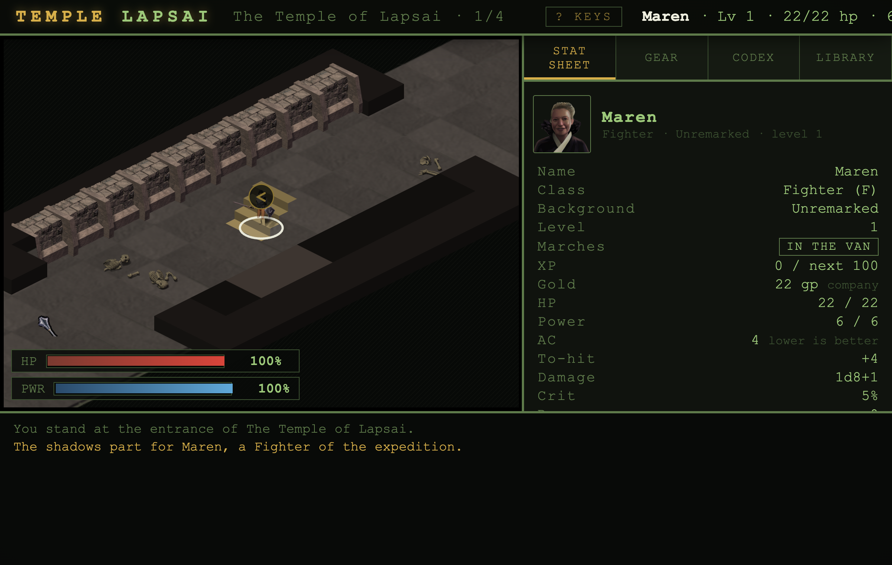
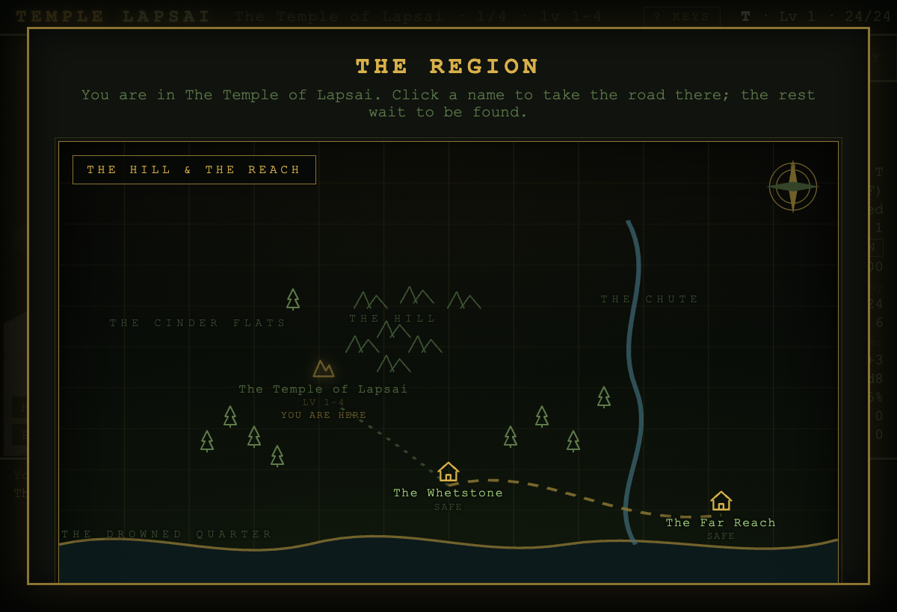
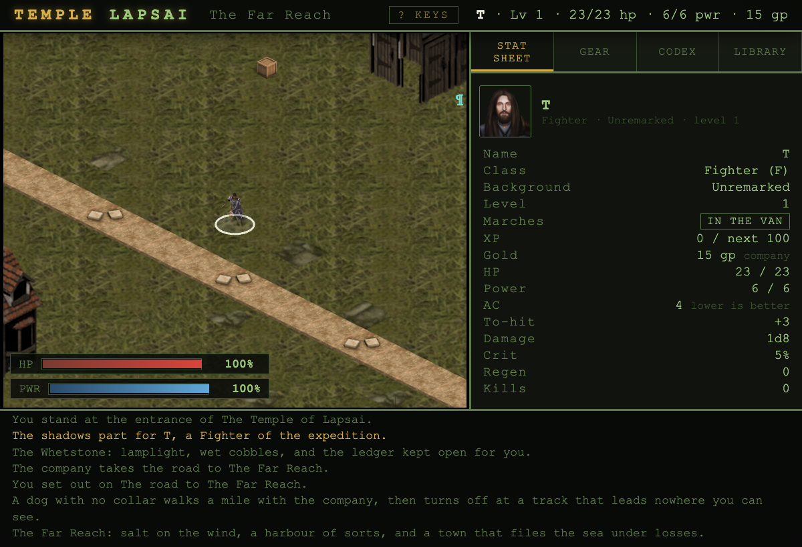
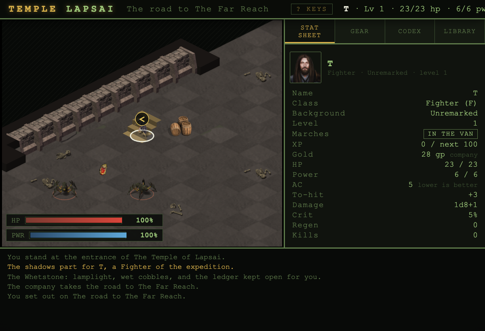

# Temple Lapsai — Turn-Based Homage

A zero-dependency, turn-based party dungeon crawler. It began as a top-down homage to the 1982
classic and has grown toward the games that came after: an **isometric scene** in the Flare art
style (the classic top-down grid is one `V` away, as the tactical map), a **company of four** with
ToEE-style combat — ground and a blow, attacks of opportunity, flanking, initiative on the screen —
**Arcanum-ish characters** with backgrounds and skills, and a walkable hamlet over the stairs.
Optional LLM-driven world expansion. Client and server are plain ES modules — no build step, no
npm install required.

**New here? Start with the [player's manual](PLAYING.md).** This README is about how the thing is
built.



*The isometric scene in Flare art, the company's stat sheet, and the dark below.*
[Title card](docs/title.png) · [Character creation](docs/charcreate.png)

**What is in it:** three hand-authored sanctums and an **endless descent** past them that needs no
LLM key; a company of four with backgrounds, skills and ability ladders; **two walkable towns** — the
Whetstone, and the coast-town Far Reach with its own mouth down — where you buy, sell, read, unbind,
**enchant**, hire, rest and raise the dead; a **region map** for fast travel, and a **road** between
the towns; seven factions that know you; twenty undertakings; a narrator who keeps the account; and a
Hall of Accounts that remembers your dead. Optional LLM-driven expansion on top of all of it.

## Requirements

- Node.js **>= 18** (uses global `fetch`, `URL`, top-level await)

## Running

```sh
npm start
# or directly:
node server.js
```

Serve yourself at http://localhost:8080. Port overrides via `PORT`.

`npm start` ties the server to the terminal that launched it — close the tab,
or let an editor session that owns it go away, and the server goes with it
(measured: SIGTERM from a session supervisor, while the machine was wide
awake). For a server that belongs to nobody and outlives all of that:

```sh
npm run serve
```

It runs detached in its own process group, appends output to `server-out.log`,
and stops only when you say so — `npm run serve:stop`, with `npm run
serve:status` to ask how it is. Either way, every way the process can end is
recorded in `server-events.log`: crashes with stacks, signals by name, exit
codes, and how long it had been up.

The game runs entirely in the browser. Character sheet, inventory, codex, library, and dungeon
generation are all client-side; progression is saved to `localStorage`.

## LLM-driven expansion (optional)

`data/expansions.json` starts empty. With an LLM API key configured, the "Library" tab generates new
dungeons, monsters, items and abilities on demand, validates them, and appends them to that file;
the client merges whatever is there into every new game on boot.

**Art for what it writes.** A generated monster carries a `sheet` field naming one of the commons'
Flare sheets (`public/js/sprites.js` → `CREATURE_SHEET_NAMES`, nineteen creatures it may borrow and
tint by tier, the same way the founding bestiary reuses sheets). The validator drops any name not on
that list, so a model cannot promise art that is not on disk. A written beast that names none — or
one written before the field existed — still wears a commons stand-in, chosen deterministically from
its props and tier by its name. Only a founding oddity the manifest deliberately nulled (the
gelatinous cube, the fire elemental) falls to the **procedural token**: a dark disc, a rim notched by
name, its glyph, and a mark for each of its props. No image, no wait, and never a bare letter.
Genuinely new art is the same seam: drop a packed Flare atlas and def under
`public/assets/creatures/` and let a monster name it.

**The cast can speak.** The dialogue machinery in `npc.js` has carried an adapter seam for an LLM
since the beginning; it is finally used. Bind an oracle and the people you meet answer **in
character** — the prompt is built from each NPC's own lore and your standing with their order
(`public/js/voice.js`), and a failed call falls back to the written line rather than an error. With
no oracle bound, the cast answer from their written lines.

### Configuration

**From inside the game.** Open the Black Library (`L`, then OPEN THE BLACK LIBRARY) and unfold
THE ORACLE. Pick a provider, paste a key, press BIND THE ORACLE, then TEST IT. Nothing needs a
restart. The choice is written to `config.json` (mode `600`, git-ignored); FORGET drops it again.

Providers are listed in `public/js/providers.js`, which both the menu and the server read — so the
menu cannot offer an endpoint the server has no dialect for:

| Provider | Dialect | Key |
| --- | --- | --- |
| OpenAI, Google Gemini, Groq, Mistral, OpenRouter | `/chat/completions` | yes |
| Anthropic | `/messages` | yes |
| Ollama, LM Studio | `/chat/completions` | no — they run on your machine |
| Custom endpoint | either | as you like |

**From the environment**, if you would rather not type a key into a web page:

```sh
OPENAI_API_KEY=sk-...  node server.js       # or ANTHROPIC_API_KEY
ORACLE_PROVIDER=groq ORACLE_API_KEY=gsk-... node server.js
```

`OPENAI_BASE_URL` / `OPENAI_MODEL` and `ORACLE_BASE_URL` / `ORACLE_MODEL` override the endpoint and
model. A `config.json` written from the menu wins over the environment — that is what FORGET is for.
The older `{"openai": {...}}` and flat `{"apiKey": ...}` shapes are still read.

## HTTP API

| Method | Path            | Description                                                         |
| ------ | --------------- | ------------------------------------------------------------------- |
| GET    | `/api/status`   | `{ ok, llmConfigured, provider, model, baseUrl, expansions }`       |
| GET    | `/api/health`   | alias of `/api/status`                                              |
| GET    | `/api/expansions`| JSON array of all installed expansions                              |
| POST   | `/api/expand`   | Generate an expansion. Returns `201 { ok, expansion }`. `503` if no oracle is bound. |
| GET    | `/api/oracle`   | The provider list, and which one is bound. Never returns the key — only its last four characters. |
| POST   | `/api/oracle`   | Bind one: `{ provider, model, baseUrl, apiKey }`. An empty `apiKey` keeps the stored one; `{ clearKey: true }` drops it; `{ reset: true }` forgets the saved settings entirely. |
| POST   | `/api/oracle/test` | One cheap call, to find out whether the key, the model name and the endpoint are real. |

`POST /api/expand` body:

```json
{
  "action": "dungeon",
  "context": { "focus": "a sunken fane of the serpent folk", "theme": "cavern" }
}
```

`action` is one of `dungeon | monster | item | ability`. `context.focus` is the creative
direction the player typed; `context.depth` pitches the result at a character of that level, and
`context.theme`, `context.cls` and `context.existing` are filled in from the current game.

Generated content is validated field by field against `public/js/contract.js` — the same
vocabulary the client renders with, and the same one the prompt's enum lists are generated from,
so what the model is offered and what the game will accept cannot drift apart. Anything that
survives validation is playable: items join the loot tables banded by tier, abilities appear on
the ability bar for the right class at the right level, monsters keep their behaviour, and
dungeons take their place in the codex once the Temple has been cleared.

Example:

```sh
curl -sX POST http://localhost:8080/api/expand \
  -H 'Content-Type: application/json' \
  -d '{"action":"monster","context":{"focus":"a chitinous horror"} }'
```

## Delving

A few rules worth knowing before you go down:

- **Secret doors** are walls until you find them. Walk into a suspicious wall to search it — thieves
  are much better at this, and an Amulet of True Seeing skips the roll entirely.
- **Water** is crossable, but wading costs the turn twice over and the splashing wakes anything
  within six tiles.
- **Floors remember you.** What you killed stays dead, what you took stays taken, doors you opened
  stay open, and the map you drew stays drawn — across stairs, saves and reloads.
- **Wounds close and power returns** while nothing awake is near you, slowly. Retreating out of
  a fight is a tactic, not a longer death. `R` sits you down until you are whole.
- **Every character walks a different dungeon.** Floors are seeded from the character, not from
  the dungeon's name.
- **Altars** stand once on every floor. Step onto one for a blessing — health, power, and any
  curse lifted. Each gives once, and will not spend itself on someone who needs nothing.
- **The belt** takes four items. Bind with BELT in the gear panel, use with **shift + 1-4**.
- **Armour class descends**, as in the modules this is an homage to: lower is harder to hit.
- The stairs down are only barred while something is at your heels.
- **Skills are visible now.** A level grants a point of learning, the Stat sheet spends it, and every
  rank prints what it is worth — `Haggle 2: 12% off buys`, `Fieldcraft 3: +30% to find seams` — so a
  rank that is working is a rank you can see working.
- **A cut can keep cutting.** Some workings leave a **bleed** that ticks on the foe's own turn, and
  can finish something that thought it had a turn left.
- **The Lower Ledger never ends.** Clear the three founding sanctums and the stair keeps going down:
  an endless descent drawn from the whole bestiary, a boss every fifth landing, no bottom — only how
  deep you got, and whether you came back to say so. It needs no LLM key.
- **The region** (press **`M`**, or click the **north gate** in the Whetstone) is the world from
  above: the Whetstone at the foot of the hill, its stairs, the coast town of **the Far Reach**, and
  the names the stories keep — the Chute, the Drowned Quarter. **You are here** is marked; click a
  place you have found and the company takes the road there — a town is a climb out, a sanctum a road
  taken, and a **road between towns is a strip you walk** — a winding coast road with its own
  wanderers, a ford to wade, a roadside altar, a **fire ring to bed down at once a crossing**, and a
  **pedlar** who works it both ways, the near end home and the far end arrived.
- **A second town.** The **Far Reach** is down the coast, where the sea gave the lower town back: its
  own chandler, tide-reader and salt-house inn, people with the sea in their speech, and a mouth down
  into **the Drowned Quarter** — the sunken district, opened once the serpent is quiet, with its own
  bestiary (drowned things still in their coats, brine hounds that do not breathe, silt wretches) and
  its own holdout: **Liss**, who kept the lamp lit when the water came and wants the sluices opened,
  which means stopping the **Tidewright** that shut them. The townsfolk ask for things too — Orrin for
  what the water keeps, Essa for her nets, and Maren in the Whetstone for the husband the temple took.





### The undertakings

The world was full of hooks that went nowhere. Ogil is "still owed" by the
salvage families; Venn has had thirty years to ask where the carved hands
emptied themselves; the four families buy godlings "cash, no questions". That
was writing for quests with no machinery behind it, so the machinery exists
now and the hooks are kept.

**A quest is offered in conversation and closed in conversation.** Walk up to
somebody who wants something and their offer sits in the dialogue card above
the input box: TAKE IT ON, and later — with the thing done — HAND IT OVER,
with the giver's own words on either side of it. Nothing is picked up from a
menu somewhere else.

Objectives are the kinds the engine can answer honestly: **slay** a named
thing, **slayAny** of a set (a cull), **gather** a number of something,
**reach** a floor, **deliver** goods to a floor (handed over on arrival, not
at a counter), keep the **altar**-rite at a number of distinct altars, read
sanctums **cleared** off the chronicle, or **all** of several parts in any
order. A slay quest counts only what dies after it was taken, because counting
kills already made is a lie the first time somebody takes a quest on a
half-cleared floor. A gather quest reads the whole **company's** packs, so
what you are already carrying counts, a companion may hold it, and nothing has
to be shuffled about first — and the goods are handed over when it closes.

Most quests **turn in** at the giver, who must be spoken to again. Some are
**field-closed** (`turnIn: false`) and pay out the moment they are satisfied,
wherever the company stands. Some are **repeatable** standing bounties — they
pay, hand over the goods, and reopen at zero, so a faction can be climbed from
stranger to one of their own rather than dead-ending after one favour. Any of
them can be **set aside** from the Codex, which returns it to the offering
rather than refusing it forever. And a few name a **faction** other than the
giver's own, so the favour answers to the order the work was really for.

Quests are the company's, like the purse and like what the company knows: they
do not live on a sheet, do not travel with whoever holds the reins, and
survive the death of the member who took them. Some are gated — behind a
dungeon cleared, or behind another quest — so they tell stories in order, from
three carved idols to the serpent under the last hill. **THE UNDERTAKINGS** at
the top of the Codex says what is wanted, how far along it is, and who is owed
the telling.

Most askings come from people, but the Lore-Weavers keep no account of you, so
theirs is **posted on the Black Library's petition** instead of spoken — taken
there, and read off the same ledger as any spoken quest.

Every asking points AHEAD of the person who makes it — Ogil stands at the
Temple's door and asks about its bottom, Eilyth stands in the drowned works
and asks about their head, Venn keeps the serpent's halls and cannot go past
the fourth door himself. A test holds that rule, because the first draft broke
it twice: a quest whose objective was already satisfied by the time its giver
could be met is a quest that closes itself.

And because the people who ask things live near the door while the stairs
remember your deepest floor, **the mouths ask where to come in**: down to the
known depth, or in at the entrance. A hand-in is never a climb.

**Standing with the powers.** Closing an undertaking earns the company's
standing with the order behind it — company-wide, like the purse, because a
favour owed to the woman who carried the idols is not owed to her alone. The
Codex's POWERS OF THE WORLD says where you stand with each of the seven and
what it has bought, because a standing you cannot feel is a number. Each order
keeps its own promise: the Carriers pay above scrap for what you haul up, the
Sisters name the safe channels so black water costs no ground, the Keepers
hold the survey open so hidden seams give sooner, the Tallymen bend their
haul-back rate down from half your gold, the Drain Toll's wererat crews let a
customer walk the Chute, the Standing Order's marching bones and walking
statues know their own once the long arrears are closed, and the Lore-Weavers'
Archive names whatever you lift. A truce only ever stops a creature *starting*
something — strike it and it defends itself, as ever.

Content lives in [quests.js](public/js/quests.js), which is data and nothing
else — the same rule [lore.js](public/js/lore.js) follows.

## The writing

The world — five eras of history, seven factions, a story arc per dungeon and a speaking cast —
lives in `public/js/lore.js`. It is content only, no logic, so it can be edited by anyone who can
count commas; `world.js` registers it on import and the engine reads it through the queries there.

Story beats fire at `(dungeonId, kind, floorIdx)`. `kind` is `enter` (arriving on a floor), `boss`,
`finish` (the dungeon cleared) or `condition` (a level-up); `type` is `narration` for a line in the
message log, `overlay` for a full card, or `flag` for bookkeeping. Floors are zero-based, and a beat
fires once per character.

Dialogue topics are matched as substrings against what the player types and the **first** match
wins — so a topic carrying a short common key (`god`, `door`) must sit below the specific topics it
would otherwise swallow. `npm test` checks that no topic is unreachable.

**The Keeper of the Account** is the one voice that is not a place and not a person — whatever keeps
the book the whole hill is written in. It speaks once at the moments the per-dungeon arcs cannot (the
first blood, the first loss, each sanctum shut, the closing of the book) and never twice, and it is
the through line the arcs only hint at. Each of the people you can meet also carries a four-rung
**greeting ladder**: walk up to them as a stranger and they say their intro; walk up once their order
has noticed you and they open their mouth by how they count you.

## Development

```sh
npm run check     # lint, then the test suite
npm test
npm run lint
```

`npm test` runs the headless suite on `node:test` — no dependencies, no build. The engine has no DOM
dependencies, so the whole game runs in Node; the tests generate floors across many seeds and
assert the invariants that are invisible by inspection: every dungeon's monster and boss ids
resolve, every floor is fully reachable from its entrance, the boss is never sealed in its den,
monsters route around walls, aggro lapses, and floor state survives a save round-trip. It also
checks the written world: that no dialogue topic is unreachable behind an earlier keyword, and that
no NPC recites a story beat the player is about to read.

`npm run lint` is a dependency-free check — every file parses, every relative import resolves, no
debug debris, and the two conventions the content depends on.

The server binds to `127.0.0.1` by default; set `HOST=0.0.0.0` if you deliberately want it on the
network. `POST /api/expand` refuses cross-origin requests and is rate-limited, because it spends
your API key.

## Project layout

```
server.js           HTTP server, static serving, LLM proxy
lib/expansion.js    Prompt building and validation of everything the oracle returns
lib/oracle.js       Which model answers the Library, and how to reach it
public/index.html   Single-page shell
public/style.css    Layout & theming
public/js/
  contract.js       THE CONTENT CONTRACT — one vocabulary shared by client and server
  providers.js      THE PROVIDER LIST — the oracle menu and the server read the same file
  describe.js       Turns an item's effects into the line of rules text under its name
  base.js           Rules/data: classes, abilities, themes, item templates, XP table
  dice.js           rpg-style dice helpers
  rng.js            seedable RNG
  mapgen.js         Room-corridor dungeon generation
  npc.js            Dialogue machinery (keyword topics, pluggable LLM adapter)
  lore.js           THE WRITING — history, factions, story arcs, the cast and their dialogue
  world.js          World layer: registers the lore and answers the engine's queries about it
  engine.js         Game state machine: movement, combat, inventory, abilities, save
  main.js           UI controller: canvas renderer, HUD, panels, keyboard, save/load, library
data/expansions.json  Persisted generated content (server-side)
```

## Controls

| Key | Action |
| --- | ------ |
| `WASD` / arrow keys | Move |
| `Y` `U` `B` `N` / numpad | Move diagonally (numpad `5` waits) |
| `G` | Take what is underfoot — or, with nothing there, look around and see what lies within reach |
| `Space` / `X` | End your turn (wait) |
| `R` | Rest until healed, or until something wakes |
| `1`–`9` | Activate the matching ability (they fire for whoever holds the reins — the sheet must be theirs) |
| `Shift+1`–`4` | Drink or read what is in that belt loop |
| `V` | Switch between the isometric scene and the classic top-down map |
| `T` | Kneel the walls to stubs, and raise them again |
| `+` / `-` | Lean in or out of the scene — to 3x, which is the size the art was painted (the mouse wheel works too) |
| `Tab` | Cycle panels (stats / gear / codex / library) |
| `I` / `E` | Gear & inventory panel |
| `C` | Codex panel |
| `L` | Library (expansions) panel |
| `Enter` | Start the game / send a dialogue line |
| `Esc` | Close the active dialogue or the controls card |
| `?` / `H` | Show the controls in-game |

### Healing

A burst heal mends **at least a share of your maximum health** — a quarter for a
Potion of Healing, half for Superior Healing, a fifth per charge of a Wand of Healing, a third
for the Cleric's Lay on Hands, half for the Fighter's Second Wind. The roll still stands whenever
it is larger, so nothing heals for less than it used to and level 1 plays exactly as it did.

The reason is arithmetic. Flat dice do not scale and everything around them does: 2d4+2 is a third
of a level-1 character and a twelfth of a level-12 one, while the thing hitting them grew the whole
way. Beside the Demon of Lapsai a Potion of Healing gave back 7 and the turn it cost gave away 14,
so drinking one left you **worse off in 97 runs out of 100** — the potion was never broken, the turn
was. The altar (35% of max) and out-of-combat regeneration already worked this way; this is the same
idea reaching the things you carry.

Every item and power prints what it will actually mend, resolved against your own health, so the
card and the engine cannot disagree.

### Bosses

A boss is exactly the creature on its card, scaled by depth like everything
else. It used to be given a silent **4x hit points** on top of that, on top of a
card that was already the biggest in the bestiary: the Demon of Lapsai arrived
with **1,129 hit points** — twenty-two times the toughest ordinary monster
standing on the same floor — against a level 6 character dealing about two
damage a turn. Measured over 720 duels, every class, every level up to 15, in
the best kit the game can hand you: nobody ever won, once.

Measured now, 60 duels a cell, in the kit each dungeon can supply:

| boss | at level | fighter | thief | cleric |
| --- | --- | --- | --- | --- |
| Demon of Lapsai (Temple) | 5 / 6 / 7 | 57% / 60% / 98% | 82% / 78% / 98% | 40% / 38% / 88% |
| Umber Hulk (Upper Reaches) | 8 / 9 / 10 | 67% / 72% / 93% | 55% / 75% / 90% | 43% / 37% / 55% |
| Great Wyrm (Serpent) | 11 / 12 / 13 | 32% / 30% / 82% | 55% / 43% / 85% | 8% / 12% / 53% |

Each boss is a real fight that levelling wins. The Mage is the known gap — its
power is a fixed pool, and once it is spent the Mage is swinging a stick.

### Initiative, and claw-claw-bite

Rounds run in **initiative order** — members and monsters interleaved, so a quick thing genuinely
acts between the fast half of the party and the slow half. Rolled **once per encounter and held**
(the way the game this is inspired by rolls it): a stable order gives every actor exactly one
action between two of any member's inputs, where a re-rolled one measurably let a monster land
twice in that window — a character quaffing at a threshold that never fails today died in
three-quarters of runs. Your DEX is your edge; a monster's speed is its. Losing initiative means
the thing that woke gets the jump — once.

Bosses fight with **routines**: claw, claw, bite — each blow rolled on its own (aiming a step
wide, so armour keeps its meaning), the depth bonus riding one entry, and soak spent once per
body per action. And the routine **repeats whole, once per body in the company**: the god has arms
for each of you. That is the boss's answer to the action economy that let any two adventurers beat
every boss in the game — measured at 100% everywhere before this, and now, at the levels the split
XP curve actually delivers: a pair wins 38/46/32% at the three bosses, a full company 94/44/20%.
Alone, every boss fights exactly as it did.

### The party

Tactical, ToEE-style: each member is a **body on the board**. Monsters hunt the *nearest* one —
the distance field they descend is seeded at every member at once — a blow lands on the body it
struck (their armour, their soak, their wounds), and sight is the union of the party's eyes. One
member falling is a wound to the party; the run ends when the **last** of them falls. Walking into
a companion trades places, the whole party takes the stairs together, calm is calm for everyone,
one Scroll of Sanctuary hides one member and not the rest, and camp beds the fallen back onto
their feet.

**Each member wears a colour** — on their map token, on the company strip above the sheets, and on
their name in the top bar, so "which of us is that" is answered the same way everywhere. Click a
chip on the strip to pin whose stat sheet and gear you are looking at; the dot marks whoever holds
the reins. Arranging a companion's straps — wear, take off, belt, give — is a free action from
their sheet at any time; *drinking* costs a turn and so belongs to whoever's turn it is.

**Items are handed over from the pack**: GIVE on any pack row, then the recipient. Free while the
party is marching; mid-fight the giver and taker must stand beside each other.

**Out of combat the party moves as one**: a single keypress steps the leader and the company keeps
pace behind them — stragglers hurry, two steps to the leader's one, so a column that fell behind
closes up. The reins stay with the leader between fights; the moment something is awake and near,
the round breaks into initiative turns.

**And it marches in formation.** The **van** walks *ahead* of whoever holds the reins, the **rear**
behind — so a mage steering the company is not also its shield when something steps out of a
doorway. Class sets the default (fighters and thieves forward, mages and clerics back) and the
`Marches` row on the stat sheet swaps any member with one click, saved with the character. The
positions you hold when a fight breaks are the positions you fight from, which is the whole point.

**Whose turn it is, three ways**: the initiative bar arrows and brightens the current actor's chip,
their nameplate on the company strip burns amber, and in a fight a gold chevron hangs over their
head on the board. Every nameplate carries a sliver of health bar, so the company's blood is one
glance up. A power that finds nothing to work on is **held, not spent** — no power, no cooldown, no
turn — so a backstab aimed on the wrong member's turn costs a log line, not the ability.

Turns are rounds: each member spends an action (the bright boxed `@` is whoever holds the reins;
companions are a step dimmer), and the monsters wait for the last of them. In a party of one, every
number in the game is measurably unchanged.

`state.player` is not a field. It is the character whose turn it is — a
non-enumerable accessor onto `state.party.members[active]` — so the ninety-odd
places in the engine and seventeen in the UI that read it keep working while
there stops being exactly one of them. Non-enumerable because `save()` is a JSON
round trip, and a `player` that serialised alongside the party would come back
as a second, divergent copy of the same character.

A save written before the party existed carries a plain `player` and no party;
restoring one makes that character a party of one, and the next save is in the
new shape.

This comes before initiative, not after, on the evidence of a design review:
ordering actors is not perceivable in a game with one actor. Measured on a
working prototype, **no monster ever acted before the player — not once in 9,614
swings** — because the game only advances on a keypress and the player's action
always resolves first. Initiative pays once there is more than one of you.

### Saved adventurers

The game keeps a **ledger**: one record per adventurer, not one save for the whole game. Rolling
someone new used to write over whoever went down last.

- **CONTINUE** opens the one you played last.
- **OTHER ADVENTURERS** opens the ledger — everyone you have sent down, with where they got to,
  what they are carrying and when they were last saved. Play any of them, or erase one (which asks
  twice).
- A character who dies is marked **fallen** on the ledger rather than in their own record, because
  the record is deliberately not written on the killing blow. Opening a fallen adventurer raises
  them at the same price the death card charges — half their gold — so a second character is never
  a way to dodge the cost of dying.
- An existing single save is adopted as the first name in the ledger the next time the game loads.
- A second ledger, the **Hall of Accounts**, keeps the runs that are *over*: a company whose
  chronicle was settled, or one written off. Newest first, with the deepest floor, the slain and the
  purse — so a good death outlives the save it was played in. Erasing a live record lays its account
  in the Hall first, and the two ledgers never touch each other's storage.

Storage lives in `public/js/roster.js` and takes its store as an argument, so all of it is covered
by tests rather than by clicking around in a browser.

### The Mage

No Vancian pool. **Ebb & Flow** (level 1, passive) makes the reserve a tide rather than a cup: while
a fight is on it seeps back a little each turn, and a blow landed with a **staff — a weapon that
carries power, which a sword does not** — draws deeper. So the turn you spend in reach is how you
buy the next Firebolt, and the mundane swing stops being the thing you do *instead* of being a Mage.
**Witch-Spark** (at will, 1d4 at six paces, costs nothing) means a dry turn is still a spell.
**Ashen Mantle** (level 3) turns damage aside for six turns, because frailty was the other half of
why a Mage could not finish a fight.

The renewal is deliberately not something the oracle may write: a Fighter with in-combat power
renewal casts Second Wind, which mends half its maximum health, without limit.

And every ability in the game now grows with practice. They were flat dice forever: a level 12
Firebolt was the same 1d8+INT as a level 1 one, while a fighter's damage grew with the weapon, the
strength and the level. That is why the Mage measured as the *weakest* attacker at depth despite
owning the only attack that cannot miss.

Boss win rates before and after, 60 duels a cell:

| | Temple | Upper Reaches | Serpent |
| --- | --- | --- | --- |
| before | 13% | 0% | 0% |
| after | 65–100% | 22–87% | 2–58% |
| fighter, for scale | 65–95% | 65–95% | 63–97% |

In the pack at the Temple, real but weaker deeper, and never once reduced to carrying the luggage.
Witch-Spark used to hand a point of power back too; measured, a Mage with both economies won 92% of
the first boss fight against a Fighter's 77%, so the spark is the action and Ebb & Flow is the whole
of the economy.

### The Whetstone

Camp grew a town around it, and gold finally has somewhere to go besides the resurrection ledger —
which was the oldest open playtest note: *"what is the purpose of gold?"* Climb out of any first
floor and you stand on the green: a timber hamlet you walk like any floor — houses with their
keepers at the door, residents with something to say, a pond, a churchyard, and the dungeon mouths
in the east field. Walking up to a keeper is how you ask for their trade.

**The Provisioner** sells what the dungeon is stingy with (the shelf grows with each boss slain) and
buys what you haul up — the Gemstone's card has said *"worth 40 gp to the right buyer"* since the
beginning, and there is finally a buyer. The fence pays for **the look of a thing, not the truth of
it**: an unread +3 blade priced at four times its base would spill the enchantment through the price
tag, and an unread curse would give itself away by being cheap.

**The Muster** hires companions — up to a company of four, each arriving at your own level with
their class weapon in hand, priced for the seasoning (60 gold + 40 per level). Experience is split
among the living, the classic way, and the fallen earn nothing until camp puts them back on their
feet.

**The Lector** reads a rune for 20 gold, so identification no longer depends on a lucky scroll
drop, and his ledger covers the **whole company's** packs and backs — as does the identify scroll,
because knowledge welded to the active member is the heal-yourself bug in different clothes. His
**back room** works the other trade: for coin he lays a **rite** on a thing you carry — *Keen Edge*
(+1 hit, +1 damage), *Warding* (+1 AC), *Deep Ward* (+1 damage soaked) — and lays it again for more
each time, so a +5 blade is a career, not a purchase.

**The Little Temple** rings curses loose for gold — the vicar unbinds anything bound, anywhere in
the company, and names it in the act. The Lector reads; the temple looses; neither does the
other's trade.

**The Drowned Lantern** beds the company for one price: everyone wakes healed, rested, cooled down
and mended — wounds included, the number nothing free can fully reach.

At the Provisioner's counter, stacks stay stacked — eight draughts are one row with a count, sell
one or the lot — and the scale takes **any member's pack** (the fallen included; their gear travels).
The coin lands in the purse doing the talking.

**Getting home stopped being a hike.** The **Scroll of Recall** folds the company back to the
Whetstone from anywhere below — it refuses mid-fight, and a refusal costs neither scroll nor turn.
And the **dungeon mouths remember your deepest floor**: monsters do not respawn, so the swept upper
halls are pure toll, and the stairs now take you straight back to where the work stopped.

The economy lives in [town.js](public/js/town.js), DOM-free like the ledger, with every price in one
table.

### Curses, and reading

An enchantment **hides until read**. A find is "Broadsword" with a blue gleam and *a rune you
cannot read* — the gear card shows what it appears to be, and a Scroll of Identify (which existed in
the data and had never once dropped — it was in no loot pool) tells you what it is.

A **curse is an enchantment lying about its sign**: the same gleam, the same rune, and the bonuses
run the other way — clamped past zero, so cursed armour is always worse than wearing nothing. You
find out by wearing it, by failing to take it off (which names it), or by reading it first. Lifting
a curse — a Draught of Unbinding, or an altar — also names it, and a swap can no longer smuggle a
cursed item off your body: `equip` refused nothing while `unequip` refused everything, a door with
no wall around it.

Old saves keep their old-style cursed items exactly as they were: souring a prize already won is
not a migration.

### Both hands are both hands

A two-handed weapon and a shield cannot be held at once. Equipping either slings the other to your
pack — with a log line, since gear quietly vanishing reads as a bug — and refuses cleanly when the
pack is full or a curse holds the conflicting hand. Old saves carrying both come back holding one.
The Library can write two-handed weapons; two-handed *shields* are dropped by the validator.

### Recovery, and the rested line

Sitting down mends what sitting down can reach. A share of every blow leaves a **wound** — a hatched
dead zone at the top of the health bar that the calm-turn trickle, the `R` key and a Ring of
Regeneration all refuse to touch.

This exists because altars had stopped mattering, and measuring said the cause was not that healing
was fast. Out-of-combat regeneration is **oversubscribed three to twelve times** — the engine offers
far more free mending than a player has room to absorb — and the walk to a floor's single altar is
**31 turns**, which at a hit point a turn is worth more than the altar gives. The bot touched an
altar on 18–29% of floors, arrived at 68–83% of maximum health, and 20–63% of firings landed on a
full bar, for 1–3.5% of all healing in a run. You cannot fix a supply nobody can use up by turning
it down; a ceiling is the one thing a walk cannot raise.

The division of labour that falls out of it:

| | reaches | costs |
| --- | --- | --- |
| **rest** (`R`) | the rested line, in one press — *shorter* than before, not longer | nothing |
| **a draught or a heal** | past the line, and closes a quarter of what it mends | an item and a turn |
| **the stairs** | mends a breath of ceiling, once per depth never reached | going deeper |
| **an altar** | *all* of it, plus half your power and every curse | walking to it |
| **camp** | everything; wounds do not follow you out of the dark | leaving |

The wound is carried as a fraction, so fifteen scratches and one mauling leave exactly the same
mark — rounding each blow up is the same mistake as clamping the regeneration fraction up to a whole
point, and on a 22-point bar it would be lethal. The line never falls below 40% of maximum.

### Loot, and water

**Loot follows the descent too.** The item tables banded on the floor's index inside its own
dungeon, took every table from the first one up, and reset the enchantment chance at each threshold
— so the Temple's last floor averaged 67 gold an item and was 40% enchanted, and the very next floor
a player walks averaged **21 gold and was 80% drawn from the dagger-and-mace table**. Four tables now
slide across the twelve floors through a window two wide, one table per dungeon, with the mix
shifting from the lower table to the upper one as the floors go by:

```
temple   1  2  3  4     upper  1  2  3  4     serpent  1   2   3   4
        15 20 29 31            44 52 66 84            102 136 157 146   gold an item
        12 17 21 20%           31 31 35 37%            43  47  54  49%  enchanted
```

**Things live in the water.** A monster with the `aquatic` property spawns *in* it and lies under
the surface — undrawn, and doing nothing — until you come within two tiles, splash into the water it
is lying in, or hit it. The Upper Reaches had Giant Leeches standing about on dry stone. Now:

```
step 1:  You wade into black water — slow going, and loud.
         The water breaks — a Giant Leech!
         Something in the dark hears the splashing.
         The Ogre hits you for 10 hit points.
```

**Water is shaped like a drowned warren.** It was sprinkled a tile at a time on a 3.5% roll — about
eighteen isolated puddles on a floor, every one walkable around — which made wading's costs (the
turn twice over, and everything within six tiles woken) something no one ever had to weigh. The
drains run with it and the low rooms stand in it now, 10% of the floor rising to 17% as the tide
comes in, and **some of what is worth having is lying in it**: `findSpot` only ever returned dry
floor, so nothing in the game had ever been in the water and there was no reason to go in.

### The descent is one curve

A dungeon's floors are numbered from the **start of the game**, not from the start of the dungeon.
The second dungeon's first floor is the fifth floor of the game and is stocked accordingly.

It used to restart the ramp at every threshold, and three things compounded: every dungeon counted
its own floors from zero; the tier band had a ceiling but no floor, so tier-0 vermin stayed in every
pool for ever; and the draw leans towards the gentle end of the pool, which made those vermin the
commonest thing on every floor of the game. Measured, the average monster on the Upper Reaches'
opening floor had **9 hit points against 17** on the Temple's last, its floor held a seventh of the
experience, and the commonest thing on either was a Sewer Rat.

Now, averaged over seeds:

```
temple   1  2  3  4     upper  1  2  3  4     serpent  1   2   3   4
         5  8 11 21            25 36 65 75             92 135 155 176   hp a monster
```

Three tests hold it there: no dungeon may open softer than the one before it closed, no floor may
be gentler than the floor above it, and what you fought three floors ago may not still be the
commonest thing you meet.

A boss's **tier says where it is met**, not how the stories rate it. The Demon of Lapsai is the god
of the first sanctum you go down and is sized for whoever gets there; carrying tier 13 while being
fought at level 5 made it the feeblest card above tier 9 and put the whole top of the bestiary out
of order.

### Experience

`gainXP` subtracts as it goes, so reaching level N costs the sum of every step below it — which made
the old curve far steeper than it read. Measured against what the generator actually puts on the
floors, clearing the whole of Temple floor one paid **106** against the **150** level two cost, so a
player finished the first floor of the game still at level one. The curve now matches the content:
level two arrives partway through floor one, and each boss is met at the level it was measured
against — the Demon at 5, the Umber Hulk at 9, the Great Wyrm at 14. The coefficient is fitted to
what the floors hold and refitted whenever they change: it has been 150, 70 and 100.

### Reading the map

Colour is not decoration. Everything alive is drawn in the red family, tinted by tier — dull rust
for vermin, deep red and bright red as it gets worse, ember and a searing pale for the things at the
bottom. Nothing you can pick up is ever red, and nothing but you is drawn `@`.
